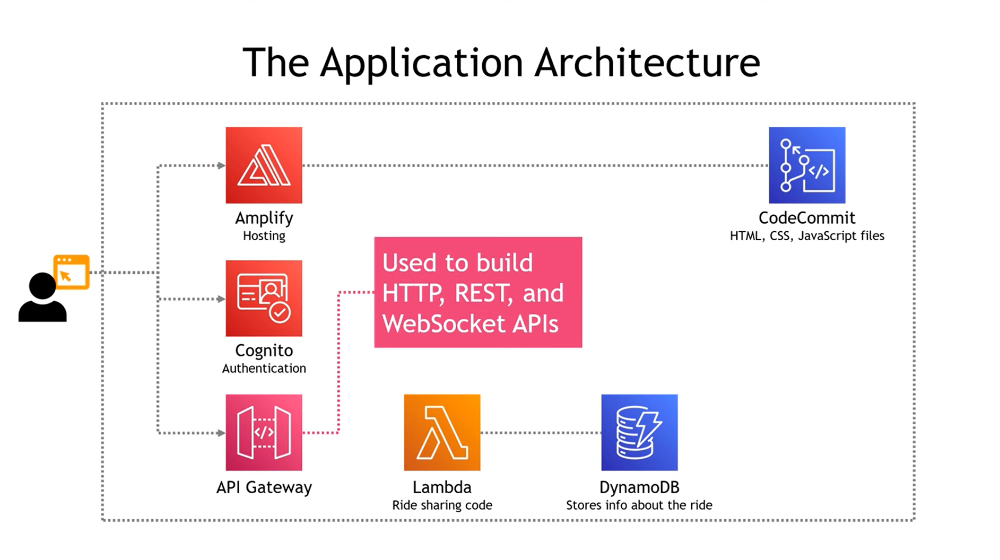
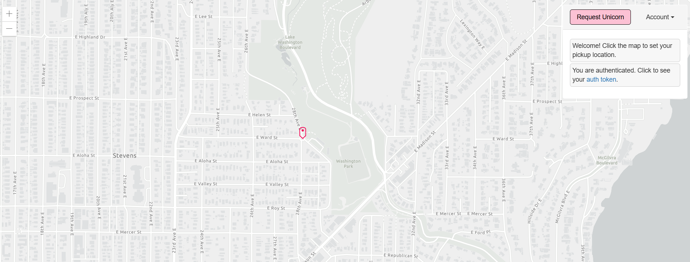

# AWS Porject - Build a Ride Web Application Using 7 AWS Services
This Project is by following this [youtube Video](https://www.youtube.com/watch?v=zuKu0VFiwas) from Tiny Technical Tutorials Channel.

## The App Code 
The application source code, here in the above folder with the two files of Lambda function code and its test code.

## Steps of Deployment
1. Put the source code on code commit repo or any VCS.
2. Deploy the code using AWS Amplify
3. Create a user pool from Cognito service  (to allow Registering of the app and store their credentails)
4. modify in config.js to integrate it with AWS Amplify by adding Pool id and client pool id to it.
5. Create DynamoDB table
6. Create lambda function IAM Role to allow it to  write into DynamoDB table
7. Create and Test lambda Function after modifying its code with the name of DynamoDB table and its Primary key
8. Create API gateway and authorizer & integrate the authorizer with User Pool of Cognito
9. modify config.js code and add the Invoke URL of api gateway test the app
10. Congratulations ^.^
## The App Architecture

## App In Action 

